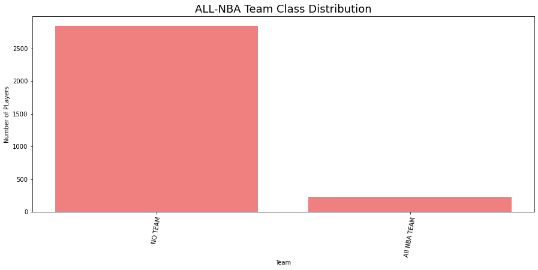
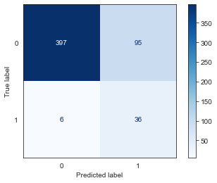
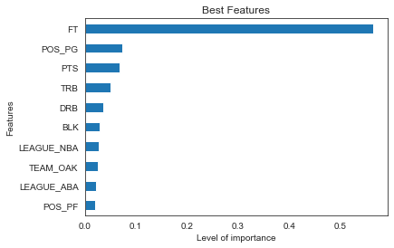
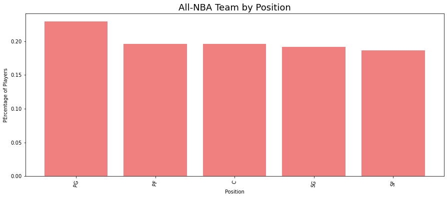
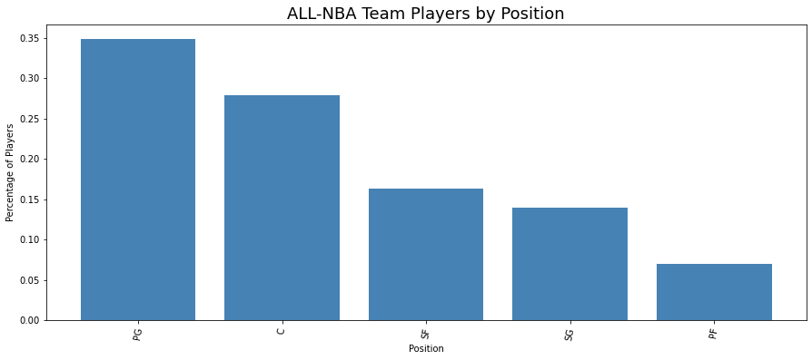
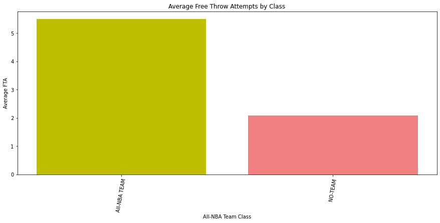
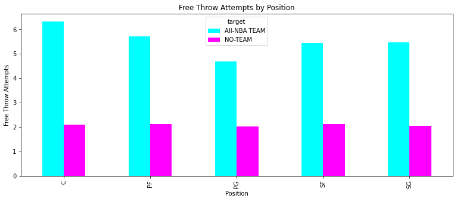
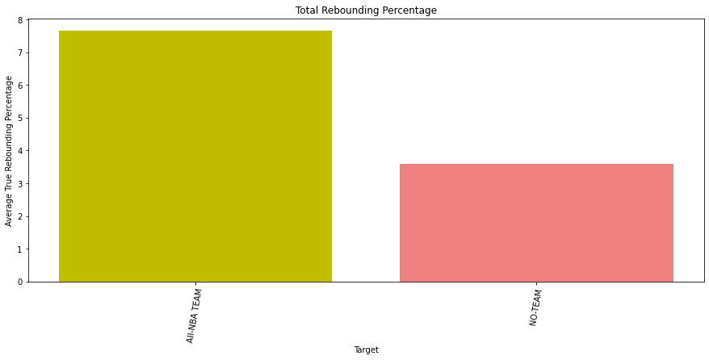
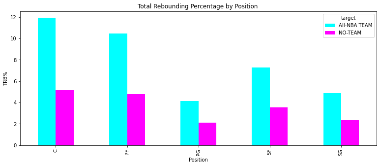

# All-NBA-Team-Analysis
** Authors: Harmandip Singh 

## Overview

This project analyzes and predicts whether NBA players will potentially become First, Second, or Third-ALL NBA team candidates or not. It is a binary classification problem and offers key insights into what potentially makes a player a star after their data in their first three years in the league. The data showed that their were several key metrics that identified a futre star and also showed a changing landscape in the NBA. One of the most important predictors were the number of Free thorw attempts a player takes. This is apparant to many avid fans in the NBA who watch playerslike James Harden continually get calls from referees. Many argue with the way fouls are called the ability to draw them is a skill in of itself and this was certainly reflected in the models. We also gained insights into the changing of the NBA and its approach to less positional basketball. In previous era there were more big men likely to become All-NBA type players but in recent years Point Guards(even more than SG) are the most likely to be voted to the ALL-NBA team. The league has also moved towrds attempting more three point percentage shots in recent years and finding players who excel at Three pointers while having the ability to generate free throws is the best predictor. 

## Business Problem
The League is largely star driven and it is important for teams to identify All-NBA potential players to suceed. Although players may join the All-NBA team in their first three years they usually join down the line. It is important for teams to identify which of these players are stars coming off thier rookie deals and who they should pay max money for or trade for if possible. 

# Data 
   
   The data was collected from the official NBA Website using and API as well as the Basketball Reference site which collect stats for players going back many years. Individual player data was pulled for all seasons in their career and contained more than 30000 rows and 25 features. The data was filtered down to players who played into their third seasons for 3000 rows of data. The target variable was whether or not players were part fo the esteemed 15 best players in the 1st, 2nd, or 3rd All-NBA team. The data consisted of an unbalance target group since only 15 players are selected each seasons. 
   
 
    
# Results

Furing the modeling process I ran many different models. Eventually to imporve some of these models we used SMOTE as well as parameter tuning using Grid Search. I decided to look for the best f1 or recall score because of our imbalanced classes. The best model below had the highest recall rate of 86%. 

The following model analyzed and said the best features were: 

# Recommendations

The data showed many different trends that were eventually corroborated by our models to help classify whether NBA players will be All-NBA Team worthy. 

The dataset showed particularly interesting trends when it came to time and position regarding ALL-NBA team selections. PRee 2000 Data showed that the positional frequencies were relatively balanced with 1:1:1:1:1 ratios when positions were selected for the All-Star game. 

However, post 2000-2001 year shows different trend in positions selected for the ALL-NBA team. There were rule changes over the years that have allowed two Guard positions and two Forward positions to be selected but there is no strict rule that there must be a balance. Therefore two SG can be selected or two PG or 1 of each. The same applies to forwards. Since the rule changes the data shows how strongly PGS have become favored to be selected as the highest position and picked over SG's. 

Other important trends and factors were the importance of certain stats like Free Throw Attempts(FTA). Star players and the 15 best players in the NBA regularly attempted the most Free throws per game relatively to the rest of the league. As far as feature importance FTA were more important than just points in determining whether a player will be an All-Star. 

The last important feature were the Total Rebounding Percentage) TRB and (Defensive Rebound Percentage) DRB percentages. The particularly are the most important when looking aat Ceneters and PF and whether or not the will be ALL-NBA team eligible.

The best indicators of sucess were Point Gaurds who shoot the most Free throw attempts and Centers who had the highest true rebounding percentage. 

